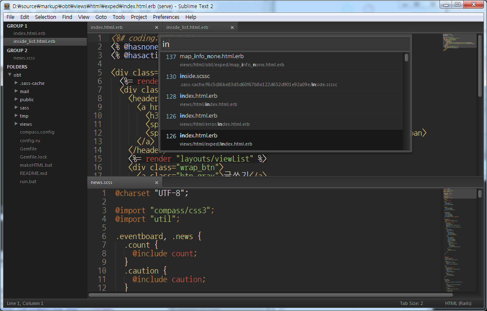
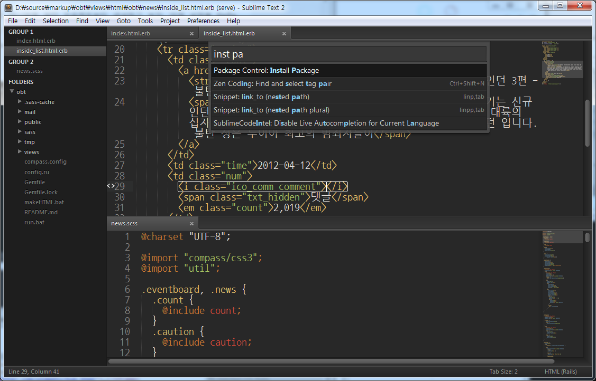
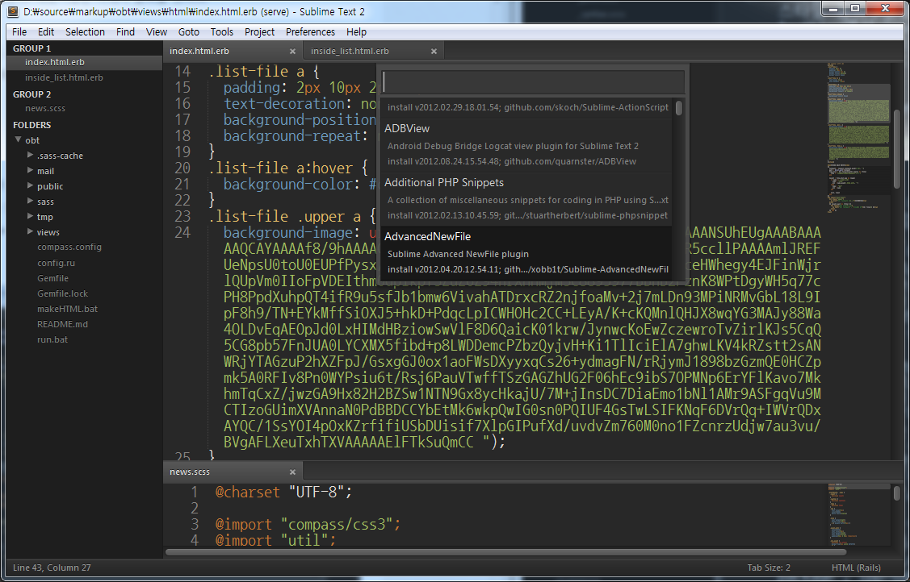

## 소개

[Sublime Text](http://sublimetext.com)를 쓰는 사람이 많이 늘었다. 맥/윈도우/리눅스를 지원하는 강력한 에디터이다. 심플함과 막강한 기능이 매력이다.

무료로 사용할 수도 있지만, (하루에 한번꼴로 구매권유 팝업이 뜨긴 한다) $59를 지불하고 정품유저로 등록하면 모든 운영체제에서 사용할 수 있는 라이센스이고, 너무도 잘 만들어진 녀석이라 나도 하나 구입해서 사용중이다.

공식 홈페이지나 문서에도 사용법이 나와 있긴 하지만,,
지금 블로그에서 사용하고 있는 마크다운 방식을 손에 익히기도 할겸, 그리고 주변에서 간단하게 사용법과 팁을 소개해 줬으면 좋겠다는 요구가 좀 있어서 가볍게 정리해 보기로 했다.

<!--more-->

## 자주 쓰게되는 단축키

- __행 들여쓰기 · 내어쓰기__
win: `ctrl+[ · ctrl+]`, mac: `cmd+[ · cmd+]`
기본적으로 탭키를 사용할 수도 있지만, 한참 코드를 작성하다가 행단위 들여쓰기를 제어하려면 이 방식이 편하기도.

- __행 상하 이동__
win: `ctrl+shift+↕`, mac: `cmd+ctrl+↕`

- __코드블럭 접기 · 펴기__
win: `ctrl+shift+[ · ctrl+shift+]`, mac: `cmd+opt+[ · opt+shift+]`


- __찾아바꾸기__
win: `ctrl+h`, mac: `cmd+opt+f`

- __여러파일에서 찾기__
win: `ctrl+shift+f`, mac: `cmd+shift+f`

- __GoTo Anything__
win: `ctrl+p`, mac: `cmd+p`
GoTo Anything을 호출한다. 해당기능은 아래서 살펴볼 것이다.

- __Command Palette__
win: `ctrl+shift+p`, mac: `cmd+shift+p`
Command Palette를 호출한다. 해당기능은 아래서 살펴볼 것이다.


## 유용한 기능

### 프로젝트단위 관리

단일파일만 작업할 것이 아니라면 일단 프로젝트부터 생성하고 보자. 아래 살펴볼 __GoTo Anything__이나 검색등을 잘 활용하려면 프로젝트 단위로 관리를 하는 것이 좋다.
상단 메뉴의 __Project - Add Folder to~__ 메뉴로 작업공간을 프로젝트에 추가하자.


### GoTo Anything

<figure>
  
  <figcaption>GoTo Anything. 파일명에 'in'이라는 단어가 들어가는 파일을 찾고 있다</figcaption>
</figure>

이름 그대로 어디로든 이동이 가능하다. 단축키를 외워두면 좋다. (위에 소개했다)
실행하면 프로젝트 내의 모든 파일의 목록이 노출된다. 타이핑을 통해 목록에서 필터링을 통해 접근할 수 있다.
예를 들면 _view/headContainer.html.erb_라는 파일에 접근하려는 경우 `view hc erb`라는 식으로 축약해 입력해도 목록에는 원하는 파일이 노출될 것이다.

단순한 파일간 이동 뿐만이 아니라 파일내의 특정부분으로 이동도 가능하다 `:line 라인넘버`를 입력해서 파일의 특정라인으로의 접근이 가능하며, `@symbol 심볼명`을 통해 함수등 특정 심볼 정의로 이동하거나 `#word 단어`를 통한 특정단어위치로의 이동도 가능하다.

심지어 파일이름과 특정부분을 조합한 이동도 가능하다.
html을 수정하다가 _sass/common.scss_의 _#container 스타일 정의부분을 수정_할 일이 생겼다. 이 경우 Goto Anything에서 `sass comm #cont`만 입력하면 간단히 원하는 위치로 이동할 수 있을 것이다.
멋지지 않은가? ;)


### Command Palette

<figure>
  
  <figcaption>Command Palette. 'install Package' 명령을 실행하기위해 간단히 'inst pa'라고 입력했다</figcaption>
</figure>

커맨드 팔렛트는 마우스 대신 키보드로 명령을 입력해서 실행할 수 있는 강력한 도구다. 이것도 단축키를 외워두면 인생이 편해진다. (위에 소개했다)
사용가능한 모든 메뉴가 노출되므로 하나하나 살펴보는 것도 좋고, __GoTo Anything__처럼 몇번의 타이핑으로 원하는 명령을 빠르게 찾을 수도 있다.
예를 들면 아래서 살펴볼 __Package Control__의 경우, 단지 `paccon`이라고 입력하는 것으로 충분하다. `pcon`도 괜찮고 `pack`도 좋다.

### Package Control

<figure>
  
  <figcaption>Package Control의 Install Package 메뉴에서 패키지 목록을 둘러보고 있다. 패키지명과 간단한 설명이 노출된다</figcaption>
</figure>

일단 서브라임 텍스트를 설치했으면 먼저 실행해야 하는 작업이 이 패키지 매니저란 녀석을 설치하는 것이다.
서브라임에서는 '패키지'라는 것이 '플러그인'의 개념이다. 패키지 매니저는 이름 그대로 서브라임이 지원하는 패키지를 관리할 수 있는 녀석이다.
복잡한 인터페이스 없이 간단한 커맨드라인명령으로 관리가 가능하다.
설치를 위해서는 먼저 콘솔창을 호출한다.


__단축키__ ``ctrl+` ``

하단에 콘솔창이 열릴 것이다.
아래의 내용을 복사해 콘솔창에 붙여넣고 실행(엔터)한다.
```
import urllib2,os; pf='Package Control.sublime-package'; ipp=sublime.installed_packages_path(); os.makedirs(ipp) if not os.path.exists(ipp) else None; urllib2.install_opener(urllib2.build_opener(urllib2.ProxyHandler())); open(os.path.join(ipp,pf),'wb').write(urllib2.urlopen('http://sublime.wbond.net/'+pf.replace(' ','%20')).read()); print 'Please restart Sublime Text to finish installation'
```


콘솔에 _Please restart Sublime Text to finish installation_라는 메시지가 출력되는 것을 확인하고 프로그램을 재시작한다.

만약 위의 명령으로 작동하지 않는다면 [installation - Sublime Package Control](http://wbond.net/sublime_packages/package_control/installation)을 참고해서 다시한번  설치를 시도해보자.

> __[2013-07-11]__ 현재 베타릴리즈 된 SublimeText3의 경우 위의 방식이 아닌 git을 통한 방법으로 설치를 해야한다. [공식사이트의 설명](http://wbond.net/sublime_packages/package_control/installation#ST3)을 참고하자.

설치를 마쳤으면 이제 커맨드 팔레트를 열어 Package Control로 다룰 수 있는 명령들을 알아보자.
많이 사용하는 명령은 다음과 같다.

- __Install Package__: 패키지를 설치한다.
- __List Package__: 설치된 패키지 목록을 확인한다.
- __Remove Package__: 설치된 패키지를 삭제한다.
- __Update Package__: 설치된 패키지에 업데이트사항이 있는지 확인하고, 업데이트 내역이 있을 경우 업데이트한다.

더 자세한 내용은 [Sublime Package Control](http://wbond.net/sublime_packages/package_control)에서 살펴볼 수 있다.

### 유용한 패키지 목록

> __[2013-07-11]__ SublimeText3의 경우 파이썬버전이 2.6 -> 3.3으로 변경되면서 호환되지 않는 패키지들이 있다. 호환성에 대해서는 [Sublime Package Control Wiki의 ST3 호환성리스트](https://github.com/wbond/sublime_package_control/wiki/Sublime-Text-3-Compatible-Packages)를 참고하도록 하자.

내가 쓰고 있는 패키지는 다음과 같다. 코딩을 즐겁게 해준다 ;)

- __[BracketHighlighter](https://github.com/facelessuser/BracketHighlighter)__
블럭영역의 시작과 끝을 눈에 좀 더 잘 띄게(?) 해준다. 기본은 옅은 밑줄만 쳐져 있어 분간이 어려웠다.

- __[Theme - Soda](https://github.com/buymeasoda/soda-theme/)__
조금은 뚱뚱한 느낌이 드는 기본 테마를 변경해준다. Theme는 에디터 내부 문법강조 컬러를 변경해주는 Color Scheme과는 다른 개념으로, 프로그램 전체의 룩앤필을 칭한다.

- __[RailsCasts Theme](https://github.com/talltroym/sublime-theme-railscasts)__
위의 Theme와는 다르게 이건 Color Scheme을 변경해준다. RailsCast 스타일이다. 현재까지 써본것중엔 기본으로 포함된 Twilight과 함께 제일 편안한 색상이다.

- __[Package Control](http://wbond.net/sublime_packages/package_control)__
위에서 살펴보았다. 다양한 패키지를 커맨드 팔렛트에서 관리할 수 있도록 해준다.

- __[Quick File Creator](https://github.com/noklesta/SublimeQuickFileCreator)__
커맨드 팔렛트에서 파일, 폴더 등을 생성할 수 있다. 마우스 안녕~

- __[AdvancedNewFile](https://github.com/skuroda/Sublime-AdvancedNewFile)__
__[2013.07.11]__ ST3 호환성문제로 위의 Quick File Creator를 대체할 녀석을 찾던 중 발견. 이쪽이 더 직관적이고 사용이 편하다.
커맨드 한번으로 파일생성 가능. `hello/im/arkist/msg.markdown`식으로 입력하면 폴더들과 파일이 한번에 생성된다. 편하다!

- __[Emmet](//emmet.io) (ZenCoding)__
[젠코딩](http://coding.smashingmagazine.com/2009/11/21/zen-coding-a-new-way-to-write-html-code/)을 가능하게 해준다. html 코딩할 때 이거 없으면 피곤하다.
__[2012.01.26]__ ZenCoding이 Emmet으로 진화했다. [Fuzzy Search](http://docs.emmet.io/css-abbreviations/fuzzy-search/) 기능 최고!

- __[SCSS](https://github.com/kuroir/SCSS.tmbundle)__
[SCSS](http://sass-lang.com/)를 위한 문법강조를 지원한다.

- __[ERB Insert and Toggle Commands](https://github.com/buymeasoda/soda-theme/)__
ERB 블럭 입력을 도와준다.

- __[SublimeCodeIntel](https://github.com/Kronuz/SublimeCodeIntel)__
코드인텔리전스 기능이다. 지원언어는 다음과 같다.
>PHP, Python, RHTML, JavaScript, Smarty, Mason, Node.js, XBL, Tcl, HTML, HTML5, TemplateToolkit, XUL, Django, Perl, Ruby, Python3

- __[SFTP](http://wbond.net/sublime_packages/sftp)__
FTP, FTPS, SFTP 지원을 위한 녀석.
_유료. 이것도 라이센스키를 입력하지 않으면 구매권유 팝업이 뜬다.

- __[Automatic Backups](https://github.com/joelpt/sublimetext-automatic-backups)__
파일을 저장할때마다 백업본을 생성해준다.
__[2013.07.11]__ ST3 호환성을 위해 [AutoBackups](https://github.com/akalongman/sublimetext-autobackups)로 대체.

----


짦은 글이었는데 글 쓰는 시간이 제법 오래 걸렸다; 그동안 글정리를 너무 소홀히 한듯..
새로운 내용이 생길때마다 이 포스트는 지속적으로 업데이트 할 것이다.
