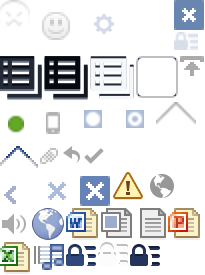

<del>이번에도 거의 한달만의</del> 결국 연말에야 겨우 완성시키는 포스팅이다.  

지난번 예고했던대로 [grunt-spritesmith](https://github.com/Ensighten/grunt-spritesmith) 를 통해 이미지 스프라이트를 자동화 하는 방법에 대해 정리해 보았다.

CSS 이미지 스프라이트가 무엇이고 왜 필요한지, 그리고 이를 수동으로 할 때 어떤 문제점이 있는지에 대해 먼저 간단히 설명하고 자동화의 이점과 방법에 대해 설명할 것이다. 'CSS 이미지 스프라이트 자동화의 필요성과 방법'이 주요 내용이 될 것이며 'CSS 이미지 스프라이트'나 'grunt', 'grunt-spritesmith'에 대해서는 괜찮은 외부자료 링크로 대신할 것이다.

<!-- more -->

## CSS image sprites?

css의 표현력이 많이 높아진 지금도 여전히 다양한 이유로 웹에서 레이아웃을 꾸미는데 이미지가 많이 사용되고 있다. 특히 한국의 경우 시스템폰트가 변변치 않아 디자인을 위해서 텍스트를 이미지로 표현하는 경우가 굉장히 많이 있다.
*이에 대해서 푸념을 늘어놓자면 끝이 없지만 그냥 넘어가겠다.*

이런 이미지파일이 하나씩 늘어날수록 HTTP 요청횟수와 파일용량이 증가하게 되어 렌더링 성능저하를 가져온다. 이를 해결하기 위한 방법중 하나가 이미지 스프라이트 기법이다. 기존에 게임 개발 등 에서 이미 쓰여오던 방식인데 웹에도 이러한 기법들이 하나씩 적용되고 있는 모습을 보면 재미있다.

원리는 어렵지 않다.  
여러개의 개별 이미지 파일을 하나로 합치고 실제 사용할때는 css의 `background-image`, `background-position` 속성을 이용해 이미지의 특정 부분만 노출되도록 하는 것이다. 실제로 적용을 하려면 이미지 파일 포맷의 특징 등과 관련하여 좀더 세부적으로 알아야 할 것들이 있다. 관련해서는 CSS-TRICKS의 [CSS Sprites: What They Are, Why They’re Cool, and How To Use Them](http://css-tricks.com/css-sprites/)을 읽어보는 것을 추천한다.

아래에 이 기법을 통해 만들어진 이미지를 하나 참고용으로 소개한다. 페이스북에서 일부영역에 사용하던 스프라이트 이미지이다. 그냥 가져온건데 뭔가 법적 문제가 생기면 내리게 될 것이다 -,.-;;

<figure>
  
  <figcaption>페이스북에서 사용중이던 스프라이트 이미지의 일부 &copy; facebook</figcaption>
</figure>

## 그래서, 문제가 뭐지?

감을 잡았다면 이제 아래의 문제들을 생각해 보자.

### 개별 스프라이트의 크기(width, height)

css에서는 '이미지의 특정부분만 노출'하도록 한다고 했다. 특정 부분만 노출하기 위해서는 스프라이트 이미지에서 개별 스프라이트의 시작점과 크기에 대한 정보가 필요하다. 먼저 스프라이트의 크기에 대한 이야기를 해보자.

크기(width, height)는 어떻게 알아내야 할까? 포토샵같은 그래픽툴을 사용해 하나로 합쳐진 이미지 파일을 열고, 개별 스프라이트의 시작점과 끝점을 알아내 직접 크기를 구해야 할 것이다.

네모반듯한 이미지라면 간단할 것이다.
하지만 조금 형태가 복잡한 이미지라면 시작점과 끝점을 찾는 게 만만치 않을 것이다. 뭐, 이건 10px, 100px 같은 단위로 오프셋을 정해놓는다던지 하는 규칙을 세워서 해결할 수 있긴 하다.
투명도가 적용된 이미지라면 상황이 좋지 않다. 위에 페이스북의 스프라이트 이미지에서 첫번째 스프라이트(X로 추정되는)를 한번보자. 이미지의 경계가 제대로 확인이 되는가? 그림자가 딸려 있는 경우에는 상황이 더욱 안좋다. 저런 이미지를 일일히 그래픽툴을 통해 그 경계를 확인하다 보면 심신이 고달프다. 나의 경우 저런 이미지들을 한땀한땀 작업하며 고통받다 단기간내에 굉장한 시력상실을 경험했다.

내가 제시하는 해법은, 스프라이트 이미지와는 별도로 개별 스프라이트의 원본 이미지 파일을 관리하는 것이다. 원본 파일 자체가 이미지의 크기에 대한 정보를 갖고 있으므로 이러한 고통에서 벗어날 수 있게 된다. 대단한 아이디어는 아니지만 나는 아직 그런식으로 관리되고 있는 프로젝트를 만나본 적이 없다. 나 자신도 그런 관리를 할 생각도 안했거니와 보통 디자인파일은 개별 리소스가 아닌 페이지 단위로 전달이 되었기 때문에 페이지에서 특정 리소스를 레이어 단위로 재단하고 한번에 스프라이트 이미지를 생성하는 프로세스로 작업을 했었다. 함께 일했던 다른 작업자들의 방식도 크게 차이가 없던 것으로 기억한다.

어쨌든 고통스러운 과정을 거쳐서 위 스프라이트 이미지 중 세번째 이미지에 대한 정보를 css로 나타내보면 다음과 같을 것이다.

```css
.icon-gear {
  width: 20px;
  height: 20px;
}
```

### 스프라이트 이미지 내에서 개별 스프라이트의 위치(position)

'이미지의 특정부분만 노출'하기 위해서는 개별 스프라이트의 시작점과 크기에 대한 정보를 알 필요가 있다고 했다. 이번에는 스프라이트 이미지내에서의 개별 스프라이트의 위치에 대해 이야기를 해보자.
css로 스프라이트에 대한 정보를 기술할때 크기에 대한 정보는 `width`와 `height`으로 나타내며, 위치에 대한 정보는 `background-position`에 음수값으로 지정해서 나타낸다.

스프라이트 이미지에서의 위치에 대한 정보는 스프라이트 이미지 자체의 정보이기 때문에 '원본파일을 관리'하는 방법으로는 해결이 불가능하다. 이 작업을 일일히 그래픽툴을 열고 픽셀값을 확인하는 작업은 매우 고통스럽기 때문에, 위에 거론했던 것처럼 오프셋을 정해놓는 식으로 보통 해결을 한다. 하지만 그럼에도 여전히 고통스러운 작업이다. 게다가 저런 규칙을 정해놓으면 완성된 스프라이트 이미지 파일은 낭비되는 빈 공간이 생기게 된다.

위에 예를 들었던 `.icon-gear`의 코드에 스프라이트의 위치 값을 추가해 보자.

```css
.icon-gear {
  width: 20px;
  height: 20px;
  background-position: -93px -14px;
}
```

`background-position` 속성을 주목하기 바란다. 저 값을 얻어내기 위해 그래픽툴을 열어 터치패드로 손을 부들부들 떨며 이미지의 시작점을 측정했다. 확대해보니 기어 아이콘에 눈에 잘 안보이는 반투명도 값이 설정되어 있이 있어 가장자리를 확인하는 것이 힘들었다. 오프셋을 정해놓는 규칙이 없다면 position을 알아내는것은 고통스러운 작업일 뿐이다.

### 스케일링

스프라이트 기법을 적용하는 이미지 갯수가 많아질수록 관리는 더 힘들어진다. 문제의 핵심은 position이다. 스프라이트 이미지의 공간효율성을 좋게 유지하면서 오프셋 규칙을 유지하는 것은 쉽지 않다. 기존에 사용하던 스프라이트를 삭제하거나 크기의 수정등이 발생하면 어떻게 할까. 개발을 하면서, 혹은 유지보수 단계에서 이미지가 수정되거나 예상하지 못한 사이즈의 이미지가 등장해서 공간효율성을 망쳐놓는 경우는 높은 빈도로 발생한다.

x/y축 반복패턴을 스프라이트하려는 경우도 문제다. 반복되는 축으로 같은 패턴을 채워넣는 식으로 구현을 하지만 그 길이를 추정하는 것은 굉장히 피곤하다. 처음 예상했던 사이즈보다 더 큰 이미지가 등장한 경우엔 어떻게 해야 할까? 이쯤되면 이미지 스프라이트 기법에 대한 회의가 밀려온다. 아무리 성능상 이점이 있다한들 유지보수성이 떨어진다면 매우 곤란하다.

### 협업환경에서의 관리

좀 더 큰 규모에서의 작업을 생각해보자. 나 혼자만이 아니라 여러사람과 함께 작업을 진행중이다. 작업자 A와 B가 각각 같은 스프라이트 이미지 파일에 새로운 스프라이트를 추가하려고 하다가 충돌이 발생했다. 누군가는 css와 이미지파일을 모두 수정해야 할 것이다. 추가가 아니라 수정/삭제 등의 이슈로 개별 이미지의 position이 변경된다면 문제는 더 커진다.

또 다른 협업 환경의 이슈로, 개별 이미지가 어느 부분에서 사용되고 있는지 확인이 어렵다는 문제도 있다. 모두 같은 클래스명으로 이미지를 사용하고 있는가? 사이즈와 위치를 동일하게 사용하고 있는가? 규칙을 정해놓지 않는다면 결국 일일히 찾아볼 수 밖에 없고, 확인이 어려우면 쉽게 관리를 포기하게 되어 버린다.


## 규칙 정하기 - 몇가지 문제를 위한 해결방법

위의 문제 중 몇가지는 규칙을 정함으로서 해결할 수 있다. 유용한 규칙 몇가지를 소개해 본다.

1. 원본이미지를 관리한다 - 이미지 사이즈 문제에서 해방될 수 있다
2. 수정이 잦은 이미지는 스프라이트 기법을 적용하지 않는다 - 관리를 조금 편하게 해준다
3. 반복패턴의 이미지는 스프라이트 기법을 적용하지 않는다 - 가장 좋은 방법은 패턴이미지의 사용을 최소하 하는 것이다
4. 이미지 포맷은 png로 통일한다 - 용량 문제로 gif를 선호할 수 도 있지만 제약이 많은 포맷이다. jpg의 경우 그라데이션 등 색상정보가 많을 때 유용할 수 있지만, 사이트 레이아웃을 구성하는데 과연 적합한 형태의 이미지인지 재고해 보길 바란다. 그라데이션 같은 경우는 css3 gradient 속성으로 대체하고 구버전 브라우저는 단색을 사용하는 방법을 고려해보라


## 자동화 - 규칙만으로는 해결할 수 없는 부분이 있다

규칙을 정해놓는다고 해도 이 작업을 사람이 하는 것은 역시 지루하고 따분한 일이다. 규칙을 좀더 정리해보면 이걸 컴퓨터가 하도록 시킬 수 있을 것 같다.  개별 스프라이트 이미지를 관리한다고 하면 다음의 추가 규칙을 생각해 볼 수 있다.

1. 원본이미지 파일명을 className으로 사용한다
2. width/height 값은 원본이미지의 width/height이다

위의 규칙으로 **개별 이미지들의 모음을 던지면 적절한 스프라이트 이미지를 생성해주고 필요한 css 코드를 생성해주는** 도구를 생각해 볼 수 있다. 물론 이런 생각은 다른 누군가가 이미 했고, 온라인 도구로 만들어 놓기까지 했다.

* [CSS Sprite 생성도구](http://ko.spritegen.website-performance.org/)
* [SpritePad](http://spritepad.wearekiss.com/)


## 자동화 - 좀 더 잘 해보자

사람이 하기 귀찮은 일을 컴퓨터에 맡기는건 좋은 아이디어다. 위의 도구들을 활용하는데서 좀 더 나아가서, 개발 프로세스에 위의 태스크를 자동으로 수행하도록 녹일 수 있다면 귀찮은 작업이 더 줄어들 것이다.
그를 위한 도구가 바로 grunt-spritesmith이다.

간략히 소개하자면, 특정 폴더에 이미지들을 넣어두고 grunt task를 실행하면 설정에 맞추어서 스프라이트 이미지와 css 코드를 생성해주는 녀석이다. 자세한 사용법은 [grunt-spritesmith의 깃헙 페이지](https://github.com/Ensighten/grunt-spritesmith#getting-started)를 참고해보자. 매우 친절하게 설명이 되어있다. 전에는 스프라이트 이미지를 생성해주기 위해 별도의 엔진을 설치해줬어야 했는데, 지금 살펴보니 3.0.0버전부터는 node로 작동하는 <code>pixelsmith</code>를 기본엔진으로 적용한 모양이다. (포스트를 완성해가는 현재 시점에서, 최신버전은 3.5.0이다)

그냥 소개만 하고 끝내면 당황할 것 같아서 예제를 만들어 보았다.
**[grunt-sass-spritesmith example](https://github.com/arkist/grunt-sass-spritesmith-example)**을 체크아웃 받아서 소스를 살펴보자.

예제가 포함하고 있는 내용은 다음과 같다

* **grunt-spritesmith task 설정:** grunt-spritesmith 사용을 위한 기본적인 grunt task 설정
* **css 코드 커스터마이징:** 바로 css 코드를 뱉어내지 않고 중간에 scss와 *.scss.mustache를 활용해 필요한 css property 코드만 생성하도록 했다
* **레티나이미지용 css 코드생성:** 일반이미지용, 레티나 이미지용 두개의 task를 만들어 모바일 등에서 사용되는 레티나 이미지 스프라이트 적용도 가능하게 했다

간단하게 코드를 구성해 놓았으니 분석이 어렵지 않을 것이다. 예제에 추가/수정을 원한다면 깃헙 프로젝트에 풀리퀘스트나 이슈를 등록해주시길 바란다.

## 정리

이런저런 핑계로 꽤나 늦었지만 결국 포스트를 마무리했다.

글의 시작에서도 밝혔지만 본 포스트에선 CSS 이미지 스프라이트기법, Sass, Grunt에 대한 기본적인 내용을 알고 있다는 가정하에 'CSS 이미지 스프라이트 자동화의 필요성과 방법'을 위주로 다루었기 때문에 그 대상이 굉장히 한정적일 것이라는 생각이 든다.

하지만 Sass, Grunt에 대해 모르는 사람이라도 CSS 이미지 스프라이팅에 고통을 겪어본 사람들이라면 본 글에 공감을 할 수 있을 것이다.
뭐 요샌 레이아웃을 꾸미는데 이미지를 쓰는일 자체가 많이 줄긴 했지만 규모가 있는 한국웹서비스를 유지보수 하려면 여전히 스프라이트를 자동화한다는건 의미가 있을 것이다.
Grunt, Sass, grunt-spritesmith의 모든 내용을 알아야 하는건 아니다. 겁먹지말고 예제를 차근히 살펴보자.

마지막으로 만약 당신이 프론트엔드 개발자이고 다양한 반복작업과 css/js의 한계에 지쳤다면 Sass와 Grunt(or <a href="http://gulpjs.com/">Gulp</a>)를 얼른 익혀보길 권하며 글을 마무리한다.

----

다음 예고는 없다. 그냥 1년전처럼 '2015년 시작' 뭐 이런글이 되지 않을까 싶네.
